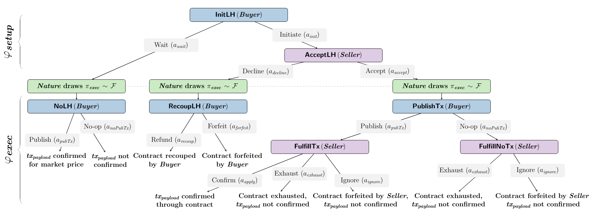

# Table of contents
- [Summary](#summary)
    - [Analytics results](#analytics-results)
- [Installation](#installation)
    - [Normal execution](#normal-execution)
    - [Interactive execution](#interactive-execution)
    - [Addendum: Installing haskell](#addendum-installing-haskell)
- [Explaining the model](#explaining-the-model)
    - [Recap: The Ledger-Hedger paper](#recap-the-Ledger-Hedger-paper)
        - [Gas price and demand](#gas-price-and-demand)
        - [Ledger-Hedger: Players and phases](#ledger-hedger-players-and-phases)
        - [Ledger-Hedger: The subgame space](#ledger-hedger-the-subgame-space)
    - [Assumptions made explicit](#assumptions-made-explicit)
        - [Refined payoffs](#refined-payoffs)
        - [Service costs](#service-costs)
        - [Modelling risk explicitly](#modelling-risk-explicitly)
- [Code deep dive](#code-deep-dive)
    - [Recap: DSL primer](#recap-dsl-primer)
        - [The building blocks](#the-building-blocks)
        - [Exhogenous parameters](#exhogenous-parameters)
        - [Basic operations](#basic-operations)
        - [Supplying strategies](#supplying-strategies)
        - [Branching](#branching)
        - [Stochasticity](#stochasticity)
    - [File structure](#file-structure)


# Summary
This project implements the model detailed in the [Ledger-Hedger](https://eprint.iacr.org/2022/056.pdf) paper. In particular, we have focused on relaxing some of the assumptions made in the paper around all players being risk-averse (in particular **Seller**). Our model allows for custom definitions of risk-sensitivity for all players.

## Analytics results
**The most important finding in our simulations is that Ledger-Hedger is incredibly sensible to initial parameters, and not as robust as we would have expected.**

A more detailed analysis can be found in the section:

First of all, we tried to replicate the analysis outlined in the paper. We used the same parameters provided there, and verified equilibrium. Curiously, in the case of logarithmic utility we weren't able to replicate the paper results for the smallest standard deviation provided. In general, this is a sympthom of the more general fact that the game-theoretic scenarios detailed in the paper are fragile. In our opinion, this depends on two main factors:

- The price of the service is taken to be very low with respect to the cost of the transaction. Looking at the examples in the paper, **Seller** is reserving **5000000** units of gas for a fixed price of 100. The payment for using the Ledger Hedger service is just **101**, which is **4** orders of magnitude less than the amounts being considered. So we see that all things staying equal the utility increment with respect to not using Ledger Hedger is marginal for **Seller**.
- In the paper, using the service has costs: **Seller** has to pay a fee to accept the Ledger Hedger contract and to close it. In particular, acceptance is priced in at **75000** units of gas for a price of **100**, which makes **7500000**.

So, just considering this, **Seller** incurs a cost that is **4** orders of magnitude higher than the price paid by **Buyer**. This choice of parameters makes the protocol extremely fragile, something that is counteracted only by the fact that we are using very concave utility functions, which represent quite high risk-aversity.

Indeed, we find out that in a risk-neutral scenario there is no difference between using or not using Ledger-Hedger *if and only if* the usage fees and payments are *both* set to **0**, meaning that the protocol is essentially 'free to use for everyone'.

Summarizing, our main findings are the following:
- Running the protocol with the parameters provided in the paper makes no sense, as the advantage in using Ledger-Hedger is very low even for very risk-averse players.
- Using Ledger-Hedger makes players incur in extra costs: **Seller** pays a fee for using the platform, whereas **Buyer** pays a (smaller) fee for using the platform *and* has also to pay **Seller** a price premium.
- These expenses are only offset by the risk-aversity of the players. The more risk-averse they are, the more it makes sense for them to carry these extra costs.
- Varying the price parameter won't help much, as price constitutes revenue for **Seller** but a cost for **Buyer**. So the more we make it convenient for the former, the less we make it convenient for the latter, and vice-versa.
- As it is instantiated, the protocol is so brittle that even small changes in the standard deviation of future gas price distribution disturb the equilibrium.
- To make the protocol more robust, the only viable option is lowering the fees for the usage of the platform, which constitute a cost both for **Buyer** and for **Seller**. 
- Finally, we hypothesize that the situation could change if **Buyer** and **Seller** have private information about the future gas price distribution. That is, the future gas price distribution is not anymore assumed to be a normal curve centered around the current price. This has not been simulated yet, as it was not included in the current working package.


# Installation

To run the model, it is necessary to have `haskell` and `stack` installed on your machine. Refer to the subsection [Addendum: Installing haskell](#addendum-installing-haskell) for instructions. A deeper dive into the code structure can be found in the [Code deep dive](#code-deep-dive) subsection.

There are two main ways of running the model: normal and interactive execution.

## Normal execution

To 'just' run the model, type
```sh
stack run
```
in the main directory, where the file `stack.yaml` is.
The model will be compiled and a predefined set of analytics will be run. The results of the predefined analytics will be shown on terminal.

## Interactive execution

One of the most powerful features of `haskell` is *REPL mode*. This allows you to recompile the code on the fly, to query the type of a function and a lot of other things. To start interactive mode, just run

```sh
stack ghci
```

in the main directory. The code will compile, and then an interactive terminal (REPL) window will open. There are various commands that can be fed to the REPL. Among the most useful ones we highlight:

| Command         | Description               |
|:----------------|--------------------------:|
| `:q`            | quit interactive mode     |
| `:r`            | recompile the source code |
| `:l module`     | load module               |
| `:t expression` | query expression type     |

Of these commands, `:t` is the most important one, as it allows to visualize clearly what type of input we must fed to a given function. For instance, `:t (&&)` produces the output:

```haskell
(&&) :: Bool -> Bool -> Bool
```

Which tells us that `(&&)` - the logical `and` operator - takes a boolean (a truth value), than another boolean, and returns a boolean (the logical and of the first two).

Since under the hood games are nothing more than functions, REPL allows us to see the game type by doing 
`:t gameName`. If the game is parametrized, say, over a string, then `:t gameName "string"` will return the type where the first component has already been filled.

This tool is expecially powerful to better understand the structure of the strategies we have to feed to the model, which can grow very complicated as the model scales.

## Addendum: Installing haskell
If you dont' have either `haskell` or `stack`, it is necessary to install them. there are many ways to do so; on Linux/macOS systems, we suggest using [ghcup](https://www.haskell.org/ghcup/).
In a terminal, type:

```sh
 curl --proto '=https' --tlsv1.2 -sSf https://get-ghcup.haskell.org | sh 
```

If asked, respond 'yes' (`Y`) to the following questions:

```
Do you want to install haskell-language-server (HLS)?
Do you want to enable better integration of stack with GHCup?
```

Afterwards, `ghcup` may ask you to install some additional packages before continuing with the installation. Follow the advice before continuing. Then, just follow the instructions through the end.

`ghcup` is a very convenient solution in that it installs only in one folder (on Linux systems, `/home/$USER/.ghcup`). Should you decide to get rid of `haskell` altogether, just delete the folder.

**A note of warning:** GHC, the `haskell` compiler installed with ghcup, relies on the GCC compiler. GHC assumes that GCC comes together with all the relevant libraries. As such, in compiling the model you may get errors such as:
```sh
/usr/bin/ld.gold: error: cannot find -ltinfo
```
these errors hint at missing GCC library, which will have to be installed independently. The precise iter to do so depends on the libraries involves and on your operating system. Unfortunately there is little we can do about it, as this is a problem with the general `haskell` developer infrastructure.


# Explaining the model
Here we give a more detailed explanation of what our model does. 

## Recap: The Ledger-Hedger paper
As our model is based on the Ledger-Hedger paper, we start by briefly recalling the main highlights of this work.

[Ledger Hedger](https://eprint.iacr.org/2022/056.pdf) is a game-theoretic mechanism for gas price reservation. *Gas size* denotes the amount of computational work needed to execute a given function in a smart contract. For instance, in the Ethereum ecosystem every EVM instruction has a fixed gas size. As the blockspace demand varies overtime, transaction issuers dynamically specify the fees they are willing to pay to get their transactions included by providing a *gas price*: The total amount the issuer will pay to the miner (or whatever equivalent role a given blockchain provides) for a given transaction to be executed is then determined as the product between gas size and gas price.

The fact that gas price varies with market conditions, generally rising when demand is high and falling when it's not, can be a problem for some transaction issuers, that would like to reserve a fixed gas price beforehand. Similarly, it can be a problem for miners, that may be unable to forecast their future profits. Ledger Hedger provides a mechanism to address this problem. We consider a system with two participants:

### Ledger-Hedger: Players and phases
The fact that gas price varies with market conditions, generally rising when demand is high and falling when demand is low, can be a problem for some transaction issuers, that would like to reserve a a fixed gas price beforehand. Similarly, this can be a problem for miners, which may be unable to forecast their future profits. Ledger-Hedger provides a mechanism to address this problem. We consider a system with two participants:

- **Buyer**, that wants to issue a given transaction in a future block interval $start<end$. The transaction's gas size - which from now on we will call $g_{alloc}$ to keep consistent with the paper - is presumed fixed.
- **Seller**, that has a given gas allocation within the above-mentioned timeframe.

This mechanism defines an interactive game articulated in two phases, called $\varphi_{init}$ and $\varphi_{exec}$, where at each stage **Buyer** and **Seller** can take different choices, as exemplified by the following figure.



Let us give a more detailed view of all the moving components in this picture.

- Phase I happens in a timeframe ranging from the current block to a block called $acc$, by which **Seller** will have to either accept or reject **Buyer**'s offer.
- Phase II happens within the block interval $start<end$. Again, this is the block interval within which **Buyer** wants their transaction executed, and in which **Seller** has gas space to offer. We postulate that $$now < acc < start < end$$

### Ledger-Hedger: The subgame space
Let us now describe the subgame space:
- **InitLH** is where **Buyer** can decide to either use or not use Leger-Hedger.
    - In the former case ($Wait$), **Buyer** just has to wait until $start$;
    - In the latter case ($Initiate$), buyer initiates the mechanism by:
        -paying an amount $SentTokens$;
        - specifying $acc$, the block number by which **Seller** must accept **Buyer**'s request. This effectively fixes when Phase I will end.
        - specifying $start < end$, the block interval within which **Buyer** wants to execute the transaction.
        - $g_{alloc}$, the amount of gas units **Buyer** wishes to use.
        - $col$, some non-negative amount of tokens that **Seller** must provide in order to accept the request.
        - $\epsilon$, a non-negative parameter needed to swing the game-theoretic equilibrium in a favourable direction.
        - All the above-mentioned parameters are fixed only once, and then are considered immutable. As it will become clear soon, the gas price **Buyer** is offering, which in the paper is denoted $\pi_{contract}$, can be calculated as: $$\pi_{contract} := \frac{SentTokens}{g_{alloc}}$$

- **AcceptLH**, where **Seller** must decide if accepting or declining **Buyer**'s offer.
    - In the former case ($Decline$), **Seller** simply waits.
    - In the latter case ($Accept$), **Seller** commits the collateral $col$.
- **Nature draws** is when Phase II starts, and the market gas price $\pi_{exec}$ becomes known. This may be higher or lower than $\pi_{contract}$.

- **NoLH** is the subgame resulting from **Buyer** not having used Ledger-Hedger. Here **Buyer** can decide to either publish the transaction anyway ($Publish$), which gets confirmed at market price, or to not publish the transaction ($No-op$).
- **RecoupLH** is the subgame where **Buyer**'s proposition was not accepted. **Buyer** can either:
    - Choose to Recoup their funds ($Recoup$), in which case **Buyer** receives back the amount $SentTokens$ in full
    - Choose to not recoup the funds ($Forfait$), in which case the amount $SentTokens$ is lost.
- **PublishTx** is the subgame where **Buyer** can decide to either publish the transaction ($Publish$) or not ($No-op$).
- **FullfillTX** is the subgame where **Seller** can:
    - Confirm the transaction ($Confirm$), thus receiving back the collateral $col$ together with the amount $SentTokens$. In practice, **Seller** executes the transaction at gas price $\pi_{contract}$.
    - Exhaust the contract ($Exhaust$). In practice this means that **Seller** will replace the transaction execution trace with a bunch of null operations. In doing so, **Seller** receives $$SentTokens - \epsilon$$
    This is fundamental, as the lower payoff makes $Confirmm$ a rationally better choice than $Exhaust$, thus incentivizing **Seller** not to 'betray' **Buyer**.
    - Ignore the situation ($Ignore$) by not doing anything. This results in **Seller** losing their collateral $col$.
- **FullFillNoTx** is a subgame similar to **PublishTx**, but in this case **Buyer** never published the transaction. In this case, the only available options for **Seller** are $Exhaust$ and $Ignore$, that work as above.

## Assumptions made explicit

In formalizing Ledger-Hedger, we had to make some assumptions,that were kept implicit in the paper, more explicit.

### Refined payoffs

First of all, the payoff types had to be refined: Whereas for some actions such as $Confirm$ or $Exhaust$ it is very clear how much **Seller** gains, in cases such as $No-op$ the utility is not specified: If one supposes that in this case the payoff is simply 0 (no gas gets spent whatsoever), then **Buyer** would default to $Wait$ and $No-op$ all the time. We had to assume, then, that the transaction that **Buyer** wants to issue has some *intrinsic utility*. This is represents the desire for **Buyer** to see the transaction included in a block and is one of the main driver to use Ledger-Hedger in the first place. 

In our model, a transaction is defined as a record of type:
``` haskell
data Transaction = Transaction
{ gasAllocTX    :: Gas
, utilityFromTX :: Utility
} deriving (Eq,Ord,Show)
```
here, `utilityFromTX` is the *intrinsic utility* of the transaction.

Another problem that required attention is the overall payoff structure. Ledger-Hedger is an interactive mechanism composed of various subgames, where a player choice determines the subgame that gets played next. This defines a tree-like structure, and payoffs are defined with respect to *game flows*, that is, a different payoff is defined for each one of the possible branches. This is in contrast with the usual approach of defining an *outcome space* (that is, a space representing all the posible outcomes of the overall game) and then defining payoffs on it (as function from this space to, say, the real numbers). 

Adopting this flow perspective, things change a great deal if one decides to add payoffs 'as things progress' or if one calculates them only when the end of a branch is reached. 

In the first case, payoffs can become negative at some stages of the game: For instance, in the subgame **AcceptLH** **Seller** gets a negative payoff when the $Accept$ decision is taken. Clearly, this allows the game to progress and **Seller** will be able to recoup the collateral together with the mining fee later on, making the payoff positive overall.

Still, adding payoffs as things progress can cause problems when one notices that the utility functions representing risk-aversion - namely `sqrt` and `log` - are well-defined only for positive numbers. To avoid this inconsistency problems we opted for calculating payoffs only when the end of a branch is reached. We also think that this represents better rational players, which are able to reason about the game until 'the very end'.

### Service costs
In the paper, actions such as **Initiate** or **Accept** have a cost, which is expressed in gas units. This makes sense as the paper is aimed at providing on-chain gas price reservation mechanisms. We incorporated these costs in the Ledger-Hedger contract type, defined as the following record:

``` haskell
data HLContract = HLContract
{ collateral    :: Collateral
, payment       :: Payment
, epsilon       :: Payment
, gasInitiation :: Gas
, gasAccept     :: Gas
, gasDone       :: Gas
} deriving (Eq,Show,Ord)
```

Here, `gasInitiation` represents the fee **Buyer** has to pay to initiate an Ledger-Hedger contract,`gasAccept` is what **Seller** has to pay to accept it, and `gasDone` represent the fee **Seller** has to pay to finally fullfill the contract. 

We stuck to the nomenclature used in the paper to aid comprehension, but since the type `Gas` is just an alias for `Double`, our model is not necessarily bound to the on-chain interpretation, and can be easily modified to accomodate more general scenarios.


### Modelling risk explicitly

Perhaps the most important assumption we made explicit is around the notion of risk the players in the paper - **Buyer** and **Seller**, respectively - have.

In a nutshell, *risk propensity* denotes how much one player prefers a *certain* payoff versus an *uncertain* one. As a simple example, let us imagine a lottery where one can win between 0 and 100 dollars with equal probability. The expected payoff in this scenario is 50 dollars. A *risk-averse* player will prefer to receive 50 dollars with certainty than playing the lottery. On the contrary, a *risk-loving* player will prefer to play the lottery: the hope for a higher payoff wins over the possibility of getting a lower one. A *risk-neutral* player will be unbiased with respect to which game to play.

In the Hedger Ledger paper, players are considered to be risk-averse or at best risk-neutral. This makes sense, as the main incentive to use Ledger Hedger is exactly hedging against the uncertainty of future gas price fluctuations:
 - A risk-averse **Buyer** seeks protection against the possibility of prices rising, resulting in bigger expenses;
 - A risk-averse **Seller** seeks protection against the possibility of prices falling, resulting in less profit.

To model this assumption explicitly, we relied on [Expected Utility Theory](https://en.wikipedia.org/wiki/Risk_aversion#Utility_of_money): In checking if the game is at equilibrium, the payoffs for both players aren't used as they are (this would be the risk-neutral case). Instead, they are first fed to a  couple of functions called `utilityFunctionBuyer` and `utilityFunctionSeller`, that can be defined in any way the modeller wants. They represent the risk propensity of both **Buyer** and **Seller**. A concave function will represent a risk-averse player, whereas a convex function will represent a risk-prone player. Supplying the identity functions will result in the standard risk-neutral case.

To model this assumption explicitly, we relied on [Expected Utility Theory](https://en.wikipedia.org/wiki/Risk_aversion#Utility_of_money): In checking if the game is at equilibrium, the payoffs for both players aren't used as they are (this would be the risk-neutral case). Instead, they are first fed to a  couple of functions called `utilityFunctionBuyer` and `utilityFunctionSeller`, that can be defined in any way the modeller wants. 

The functions represent the risk propensity of both **Buyer** and **Seller**. A concave function will represent a risk-averse player, whereas a convex function will represent a risk-prone player. Supplying the identity functions will result to the standard risk-neutral case.

Besides the identities, we also provided a square root definition and a logarithmic definition for the utility functions, which can be found in `Parametrization.hs`

In practice, these functions are used as follows (cf. [Code deep dive](#code-deep-dive) for syntax details):

`returns : utilityFunction $ plainPayoffFunction data;`

What this means is that we are piping the output of `plainPayoffFunction` to a utility function, that 'skews' the payoff by virtue of being concave or convex.


# Code deep dive

## Recap: DSL primer

Our models are written in a custom DSL compiled to `haskell`. Here we give a brief description of how our software works.

### The building blocks
The basic building block of our model is called **open game**, and can be thought of as a game-theoretic lego brick. This may represent a player, a nature draw, a payoff matrix or a complex combination of these elements. It has the following form:

```haskell
gameName variables = [opengame|

   inputs    : a;
   feedback  : b;

   :----------------------------:

   inputs    : a';
   feedback  : b';
   operation : content;
   outputs   : s';
   returns   : t';

   :----------------------------:

   outputs   :  s;
   returns   :  t;
  |]
```

We can imagine this block as a box with 4 wires on its outside, on which travels information marked as:
- `input`, data that gets fed into the game (e.g. a player receiving information from a context).
- `outputs`, data that the game feeds to the outside world (e.g. a player communicating a choice to another player).
- `returns`, the returns of a player actions, which are usually directly fed to a function calculating payoffs.
- The `feedback` wire which sends information back in time. In the case of the ledger hedger, for instance, the buyer needs information about how he will be affected down the road when making the decision to initiate the contract or not. This information is send through the feedback field. For details about its usage please refer to the relevant [literature](https://arxiv.org/abs/1603.04641).

The `:--:` delimiters separate the outside from the inside of the box. As one can see, the interfaces inside are replicated. This is intentional as it allows for a notion of *nesting*. For instance, the situation depicted in the following picture:


Can be represented by the following code block:

```haskell
gameName variables = [opengame|

   inputs    : a, a';
   feedback  : b;

   :----------------------------:

   inputs    : a';
   feedback  : ;
   operation : SubGame1;
   outputs   : x;
   returns   : t';

   inputs    : a, x;
   feedback  : b;
   operation : SubGame2;
   outputs   : s;
   returns   : t;
   :----------------------------:

   outputs   :  s;
   returns   :  t,t';
  |]
```

In turn, `Subgame1` and `Subgame2` can be other games defined using the same DSL. Notice that the wire `x` is internal and totally hidden from the 'outside world'. 

### Exhogenous parameters
An exhogenous parameter is a given assumption that is not part of the model, and is fed to it externally. As such, it is treated by the model as a 'fact' that cannot really be modified. An example of exhogenous parameters could be the market conditions at the time when a game is played.

Exhogenous parameters are just defined as variables, as the field `variables` in the previous code blocks testifes. These variables can in turn be fed as exhogenous parameters to inside games, as in the following example:

```haskell
gameName stock1Price stock2Price  = [opengame|

   inputs    : a, a';
   feedback  : b;

   :----------------------------:

   inputs    : a';
   feedback  : ;
   operation : SubGame1 stock1Price;
   outputs   : x;
   returns   : t';

   inputs    : a, x;
   feedback  : b;
   operation : SubGame2 stock2Price;
   outputs   : s;
   returns   : t;
   :----------------------------:

   outputs   :  s;
   returns   :  t,t';
  |]
```

### Basic operations

In addition to the DSL defining the 'piping rules' between boxes, we provide some *basic operations* to populate a box, namely:
- A *function*, which just transforms the input in some output.
- A *stochastic distribution*, used to implement draws from nature.
- A *strategic choice*, which can be thought of as a function parametrized over strategies.
<<<<<<< variant A
>>>>>>> variant B
- A *addPayoffs* internal operation: Since in our software everything is a game, we need to keep track of who-is-who. Namely, there may be different subgames in our model that are played by the same player. In this situation, the payoffs of these subgames must be combined. *addPayoffs* does exactly this form of bookkeeping.
======= end

#### Branching

<<<<<<< variant A
>>>>>>> variant B
To evaluate strategies, it is enough to just run the `main` function defined in `Main.hs`. This is precisely what happens when we give the command `stack run`.  In turn, `main` invokes functions defined in `Analytics.hs` which define the right notion of equilibrium to check. If you want to change strategies on the fly, just open a repl (Cf. [Interactive Execution](#interactive-execution)) and give the command 'main'.
You can make parametric changes in `Parametrization.hs` or even define new strategies and/or notions of equilibrium by editing `Stategies.hs` and `Analytics.hs`, respectively. Once you save your edits, giving `:r` will recompile the code on the fly. Calling `main` again will evaluate the changes.

As a word of caution, notice in a game with branching, we need to provide a possible strategy for each branch. For example, suppose to have the following game:

- Player 1 can choose between option A and B;
    - case A: Player 2 can choose between option A1 or A2;
    - case B: Player 2 can choose between option B1 or B2;

Moreover, suppose that the payoffs are as follows: 

- If Player1 chooses A, and then Player2 chooses A1, then both players get 100$.
- In any other case, both players get 0$.

In this game the best strategy is clearly (A,A1). Nevertheless, we need to supply a strategy for Player2 also in the 'B' branch: Even if Player1 will never rationally choose B, Player2 needs to be endowed with a clear choice between B1 and B2 in case this happens.

### Branching
======= end
Another important operation we provide is called *branching*. This is useful in contexts where, say, a player choice determines which subgame is going to be played next.
Branching is represented using the operator `+++`. So, for instance, if `SubGame1` is defined as ```branch1 +++ branch2```, then we are modelling a situation where `SubGame1` can actually evolve into two different games depending on input. As the input of a game can be the outcome of a strategic choice in some other game, this allows for flexible modelling of complex situations.

Graphically, branching can be represented by resorting to [sheet diagrams](https://arxiv.org/abs/2010.13361), but as they are quite complicated to draw, this depiction is rarely used.

#### Stochasticity

Our models are Bayesian by default, meaning that they allow for reasoning in probabilitic terms.

Practically, this is obtained by relying on the [Haskell Stochastic Package](https://hackage.haskell.org/package/stochastic), which employs monadic techniques.

A consequence of this is that deterministic strategic decisions (e.g. 'player chooses option A') must be lifted into the stochastic monad, getting thus transformed into their probabilistic equivalent (e.g. 'of all the option available, player chooses A with probability 1')

A practical example of this can be found in `Strategies.hs`, where we have:

```haskell
acceptStrategy
  :: Kleisli
       Stochastic
       (Transaction, HLContract, GasPrice)
       AcceptDecisionSeller
acceptStrategy = pureAction Accept
```

`pureAction` lifts the deterministic choice `Accept` to the corresponding concept in the probabilistic realm. 

The upside of assuming this little amount of overhead is that switching from pure to mixed strategies can be easily done on the fly, without having to change the model beforehand.

#### Supplying strategies

The previous example `acceptStrategy` showed the general construction of a strategy for a single player. As usual in classical game theory, a strategy conditions on the observables and assigns a (possibly randomized) action. In the example above, the player observes the transaction, the hedger ledger contract, as well as the (initial) gas price, and then must assign an action (either accept or reject).

Every player who can make a decision in the game needs to be assigned a strategy. These individual strategies then get aggregated into a list representing the complete strategy for the whole game.

So, for instance, if our model consists of three subgames, a strategy for the whole model will just be a list:

```haskell
`strGame1 ::- strGame2 ::- strGame3 ::- Nil`.
```
Our analysis is focused on understanding when the targeted equilibrium, where the hedger ledger contract gets initiated and later published by the buyer as well as accepted and confirmed by the seller, can be supported. Concretely, this means we employ the following strategies:

```haskell

-- | initiate contract strategy 
initiateStrategyBuyerTarget
  :: Kleisli
           Stochastic
           (Transaction, HLContract, GasPrice)
           (InitialDecisionBuyer HLContract)
initiateStrategyBuyerTarget =
  Kleisli (\(_,contract,_) -> playDeterministically $ Initiate contract)

-- | publish strategy if no LH
noLHPublishStrategyTarget
  :: Kleisli
       Stochastic
       (Transaction, GasPrice)
       (PublishDecision Double)
noLHPublishStrategyTarget = pureAction $ Publish 0.0

-- | accept decision seller
acceptStrategyTarget
  :: Kleisli
       Stochastic
       (Transaction, HLContract, GasPrice)
       AcceptDecisionSeller
acceptStrategyTarget = pureAction Accept

-- | recoup strategy buyer
recoupStrategyTarget
  :: Kleisli
       Stochastic
       (Transaction, HLContract, GasPrice)
       RecoupDecisionBuyer
recoupStrategyTarget = pureAction Refund

-- | publish strategy part 1 if LH
lhPublishStrategyPart1Target
  :: Kleisli
       Stochastic
       GasPrice
       (PublishDecision Double)
lhPublishStrategyPart1Target =  pureAction $ Publish 0.0

-- | publish strategy part 2 if LH
lhPublishStrategyPart2Target
  ::  Kleisli
          Stochastic
          (GasPrice, Transaction, PublishDecision a1)
          (PublishDecision Gas)
lhPublishStrategyPart2Target =
  Kleisli
   (\(pi,tx,publishDecision) -> 
        case publishDecision of
          NoOp -> playDeterministically NoOp
          Publish _ -> playDeterministically $ Publish $ gasAllocTX tx)

-- | fulfill strategy
fulfillStrategyTarget
  :: Kleisli
       Stochastic
       (Transaction, HLContract, GasPrice, Gas)
       FulfillDecisionSeller
fulfillStrategyTarget = pureAction Confirm

-- | noFulfill strategy
noFulfillStrategyTarget
  :: Kleisli
       Stochastic
       (Transaction, HLContract, GasPrice)
       FulfillDecisionSeller
noFulfillStrategyTarget = pureAction Exhaust
```

### File structure

The model is composed of several files:

- `app/Main.hs` contains all the main ingredients already set up for a run. Executing it will execute equilibrium checking on some of the most interesting strategies we defined. We suggest to start from here to get a feel of how the model analysis works.
- `Model.hs` is the file where the main model is defined.
- `Components.hs` is where the subgames making up the whole model are defined.
- `Payoffs.hs` is where the payoff functions used in every subgame are defined. We decided to keep them all in the same file to make tweaking and fine-tuning less dispersive.
- `Strategies.hs` is where the strategies we want to test are defined.
- `Parametrization.hs` defines the concrete parametrizations used for the analysis: e.g. intrinsic utility of **Buyer**'s transaction, fixed costs for initiating a Ledger-Hedger contract etc.
- `Types.hs` is where we define the types of the decisions to be taken (e.g. $Wait$ or $Initiate$ a Ledger-Hedger contract) and the types of `HLContract` and `Transaction`. Here we also define the types for payoffs, gas etc. These are all aliased to `Double`.
- `ActionSpaces.hs` is mainly needed for technical type-transformations. It maps a player's decision type into the type needed to be fed in the subsequent game.
- `Analytics.hs` defines the equilibrium notion for each game we want to test.
- `Diagnostics.hs` is the file detailing which and how much information we want to show when strategies are tested.

Relying on the DSL Primer, parsing the code structure should be a manageable task.

Moreover, the repository is split in two different branches:
- In `main` we have the basic model, where both players are supposed to be risk-neutral. Here the code has less overhead and syntactic clutter so we strongly avice to start here to have a better understanding of the code.
- In `utility-functions` we added two new functions, `utilityFunctionBuyer` and `utilityFunctionSeller`.
Every game defined in `Model.hs` and `Components.hs` has been edited accordingly. The most important changes are in how `returns` is defined in many subcomponents. If before we had, say, 

For more information about how to supply strategies and/or how to make changes, please refer to the section [Supplying Strategies](#supplying-strategies).

## Reading the analytics

Analitycs in our model are quite straightforward. In case a game is in equilibrium, the terminal will print `Strategies are in eqilibrium`.

For games with branching, there will also be a `NOTHING CASE`. To understand this, consider a game (call it `First Game`) that can trigger two different subgames (`Subgame branch 1`, `Subgame branch 2`, respectively) depending on the player's choice. Analytics would read like this:

```
 Game name
First Game:

 Strategies are in equilibrium
Subgame branch 1:

 NOTHING CASE
Subgame branch 2:

 Strategies are in equilibrium
```

Here `NOTHING CASE` signifies that the choice provided by the player results in not visiting `Subgame branch 1`, which is thus never played in this senario: Evidently, the choice made by the player in `First Game` resulting in the play continuing on `Subgame branch 2`.

On the contrary, analytics become more expressive when the game is *not* in equilibrium. In this case, the engine will suggest a more profitable deviation by displaying the following prompt:

```
Strategies are NOT in equilibrium. Consider the following profitable deviations: 

Player: 
Optimal Move: 
Current Strategy:
Optimal Payoff: 
Current Payoff: 
Observable State:
 --other game-- 
 --No more information--
```

`Observable State` contains a dump of all the game parameters that are currenlty observable by all players. This is usually a lot of information, mainly useful for debugging purposes. All the other field names are pretty much self-describing. 


## Replicating the Ledger-Hedger Paper results
To replicate the results claimed in the Ledger-Hedger paper, we instantiated the model with the following parameters (the instantiation can be found in `Parameters.hs`):

| **Parameter**  | **Name in the paper** | **Meaning** | **Value** |
|:--------------:|:---------------------:|:-----------:|:----------:|
| `wealth`       | $W^{init}_{Buyer}$    | Initial wealth of **Buyer** | $10^9$           |
| `wealth`       | $W^{init}_{Seller}$   | Initial wealth of **Seller** |$10^9$           |
| `collateral`   | $$col$$               | The collateral **Seller** must pay to accept LH contract | $10^9$           |
| `payment`      | payment               | The payment **Buyer** makes to **Seller** when LH contract is concluded. | $100$            |
| `epsilon`      | $\epsilon$            | Technical parameter to disincentivize unwanted behavior from **Seller**. | $1$              |
| `gasInitiation`| $g_{init}$            | Cost of opening a LH contract. | $0.1 \cdot 10^6$ |
| `gasAccept`    | $g_{accept}$          | Cost of accepting a LH contract. | $75 \cdot 10^3$  |
| `gasDone`      | $g_{done}$            | Cost of closing a LH contract. | $20 \cdot 10^3$  |
| `gasAllocTX`   | $g_{alloc}$           | Gas reserved in the LH contract. | $5 \cdot 10^6$   |
| `gasPub`   | $g_{pub}$           | Gas size of the TX if issued at current market price. | $5 \cdot 10^6$   |

These parameters were directly pulled from Sec. 6 of the Ledger-Hedger paper. As for the utility functions, we again followed what the authors did by instantiating the utility functions for both **Buyer** and **Seller** to be first $log(x)$ and then $\sqrt(x)$. These function represent risk-aversity.

As for future price distribution, we defined it as `testDistribution`: This is a normal distribution centered around the initial gas price. Again, we used the standard deviations suggested in the paper. Moreover, we defined `testActionSpaceGasPub`, representing the range in which $g_{pub}$ can swing. $g_{pub}$ is the gas consumed if **Buyer** decides to issue the transaction at market price, thus without resorting to Ledger-Hedger. In practice, we followed the paper and equated $g_{pub}$ and $g_{alloc}$, meaning that **Buyer** is using Ledger-Hedger to reserve the precise amount of gas needed to execute the transaction.

